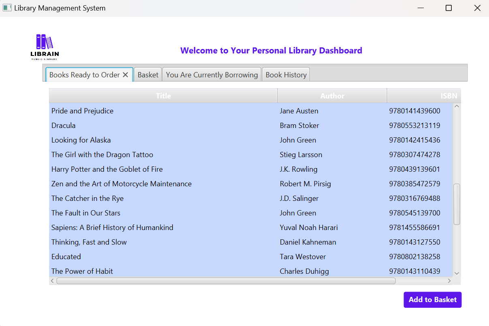
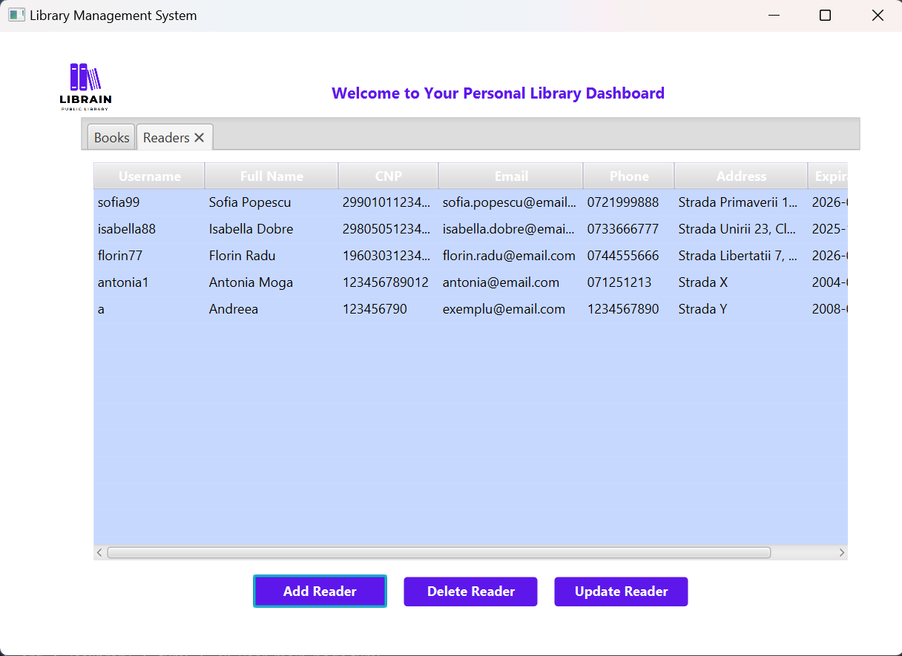

# Library Management App - ISS

## Descriere Proiect

Aceasta este o aplicație pentru gestionarea unei biblioteci care permite abonaților să împrumute cărți prin intermediul terminalelor disponibile. Aplicația este dezvoltată folosind JavaFX pentru interfață și SQLite pentru gestionarea bazei de date.

---

## Tehnologii folosite

* **Baza de date:** SQLite
* **Interfață:** JavaFX (FXML)
* **Programare:** Java

---

## Cerința

### 1. BIBLIOTECA

O biblioteca ofera abonatilor sai o lista de carti ce pot fi imprumutate. Pentru un abonat, se retin în
sistem (cel putin) informații legate de cnp, nume, adresa, telefon și un cod unic de identificare a
acestuia în cadrul bibliotecii. Fiecare carte poate exista în unul sau mai multe exemplare, identificate
prin coduri unice. Biblioteca are mai multe terminale, de unde abonatii pot sa imprumute carti. Pentru
a putea folosi un terminal, un abonat trebuie să se autentifice. Dupa autentificare, acesta vede lista
exemplarelor disponibile în acel moment si poate imprumuta unul sau mai multe. Pentru restituirea
cartilor, exista un singur punct de lucru, deservit de un bibliotecar. Dupa fiecare împrumut/restituire,
toți utilizatorii terminalelor bibliotecii văd lista actualizata a cartilor disponibile
---

## Interfață grafică

Mai jos sunt capturi de ecran numerotate cu principalele ferestre și funcționalități ale aplicației:

| Nr. | Imagine                        | Descriere                            |
| --- | ------------------------------ | ------------------------------------ |
| 1   |    | MainPage  |
| 2   |    | Autentificare Reader                 |
| 3  |    | Reader Page              |
| 4  |    | Reader Page              |
| 5  |    | Reader Page              |
| 6  |    | Reader Page              ||
| 7  |    | Autentificare Librarian                |
| 8  |    | Librarian Page                |
| 9  |    | Add Book - Librarian Page                |
| 10  |    | Librarian Page                |
| 11  |    | Add Reader - Librarian Page                |
| 12  |    | Update Reader - Librarian Page                |
| 13  |  | Librarian Page |

